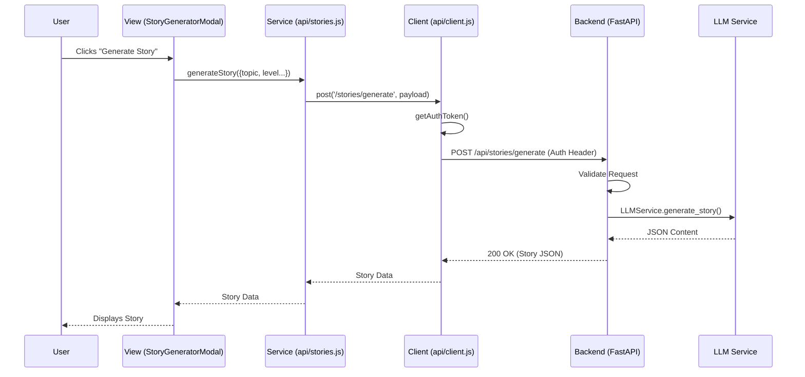

# Frontend-Backend Interaction Map

## Overview
This document outlines the communication interface between the React frontend and the Python FastAPI backend in the Vibe Language Learning application.

## Communication Architecture

### Primary Channel: HTTP REST API
- **Frontend**: React application (running on port 5173 in dev)
- **Backend**: FastAPI server (running on port 8000)
- **Proxy**: Vite (`vite.config.js`) proxies requests from `/api` to `http://localhost:8000` to avoid CORS issues during development.

### Implementation Pattern

#### 1. Centralized API Client (`src/services/api/client.js`)
- Handles all HTTP requests (GET, POST, PUT, DELETE)
- Automatically injects Firebase Auth tokens
- Manages base URL configuration

#### 2. Service Modules
- **New Pattern**: `src/services/api/*.js` (e.g., `stories.js`)
  - Imports `client.js`
  - Defines specific API methods (e.g., `generateStory`)
  - Calls backend endpoints (e.g., `/stories/generate`)
  
- **Legacy Pattern (To Be Migrated)**: `src/services/*.js` (e.g., `gemini.js`)
  - Makes direct calls to external APIs (Google, OpenAI)
  - Contains business logic that should be in the backend

## The "Standard" Contract: OpenAPI (Swagger)
The FastAPI backend automatically generates an OpenAPI specification, which serves as the definitive contract for interactions.

- **Documentation URL**: `http://localhost:8000/docs`
- **Specification**: Defines all available endpoints, required parameters, and response schemas.

## Interaction Flows

### Example: Story Generation Flow

## Migration Plan
To fully standardize the application:
1.  **Identify Legacy Calls**: Audit `src/services/` for direct external API usage.
2.  **Create Backend Endpoints**: Ensure FastAPI has equivalent endpoints.
3.  **Update Frontend Services**: Rewrite JS services to use `api/client.js` and call the new endpoints.
